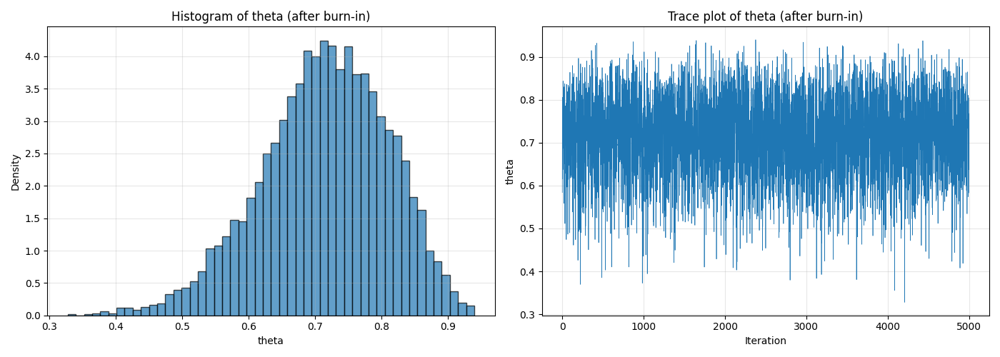
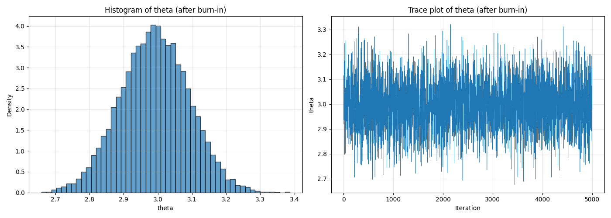

# 과제 답안

## 과제 3

## 문제 1
### **[ 문제 1-(1) ]** Gibbs Sampling 코드 작성 및 결과 시각화

```python

# 1
theta_init = 0.5
x_20_init = 1

# 2
T = 10000

# 3
theta_sample = []
x20_samples = []

# 4
theta_prev = theta_init
x20_prev = x_20_init

# 5
for t in range(T):
    # update x20
    x20_curr = bernoulli.rvs(p=theta_prev)
    
    # update theta
    alpha = y + x20_curr + 1
    beta_param = 20 - y - x20_curr + 1
    theta_curr = beta.rvs(a=alpha, b=beta_param)
    
    # 배열에 추가
    theta_sample.append(theta_curr)
    x20_samples.append(x20_curr)
    
    # 현재 값을 이전 값으로 취급 (다음 step 업데이트 진행 위해)
    theta_prev = theta_curr
    x20_prev = x20_curr

# 6
burn_cnt = 5000
theta_sample_b = theta_sample[burn_cnt:]
x20_samples_b = x20_samples[burn_cnt:]

# visualize
fig, axes = plt.subplots(1, 2, figsize=(14, 5))

# hist
axes[0].hist(theta_sample_b, bins=50, density=True, alpha=0.7, edgecolor='black')
axes[0].set_xlabel('theta')
axes[0].set_ylabel('Density')
axes[0].set_title('Histogram of theta (after burn-in)')
axes[0].grid(True, alpha=0.3)

# traceplot
axes[1].plot(theta_sample_b, linewidth=0.5)
axes[1].set_xlabel('Iteration')
axes[1].set_ylabel('theta')
axes[1].set_title('Trace plot of theta (after burn-in)')
axes[1].grid(True, alpha=0.3)

plt.tight_layout()
plt.show()
```

### **[ 문제 1-(2) ]** $\theta$에 대하여 다음의 값들을 구하여라.
#### (a) $\theta$에 대한 posterior mean
> 답: 0.7133

#### (b) $\theta$에 대한 posterior median
> 답: 0.7213

#### (c) $\theta$에 대한 posterior variance
> 답: 0.009292

#### (d) $\theta$에 대한 95% credible interval
> 답: [0.5091, 0.8811]

```python

# a
theta_posterior_mean = np.mean(theta_sample_b)
print(f"(a) $\theta$에 대한 posterior mean: {theta_posterior_mean:.4f}")

# b
theta_posterior_median = np.median(theta_sample_b)
print(f"(b) $\theta$에 대한 posterior median: {theta_posterior_median:.4f}")

# c
theta_posterior_var = np.var(theta_sample_b, ddof=1)
print(f"(c) $\theta$에 대한 posterior variance: {theta_posterior_var:.6f}")

# d
theta_ci_L = np.percentile(theta_sample_b, 2.5)
theta_ci_U = np.percentile(theta_sample_b, 97.5)
print(f"(d) $\theta$에 대한 95% credible interval: [{theta_ci_L:.4f}, {theta_ci_U:.4f}]")

```

### **[ 문제 1-(3) ]** $x_{20}$에 대하여 다음의 값들을 구하여라.

#### (a) $x_{20}$에 대한 posterior mean
> 답: 0.7110

#### (b) $x_{20}$에 대한 posterior variance
> 답: 0.205520

```python

# a
x20_posterior_mean = np.mean(x20_samples_b)
print(f"(a) $x_{20}$에 대한 posterior mean: {x20_posterior_mean:.4f}")

# b
x20_posterior_var = np.var(x20_samples_b, ddof=1)
print(f"(b) $x_{20}$에 대한 posterior variance: {x20_posterior_var:.6f}")

```

---
## 문제 2

### **[ 문제 2-(1) ]** Metropolis-Hastings Algorithm 코드 작성 및 결과 시각화


```python

# 1
theta_init = x_bar

# 2
T = 10000

# 3
theta_sample = []

# 4
theta_prev = theta_init

# 5
for t in range(T):
    # 제안분포에서 후보 Y 샘플링: Y ~ N(x_bar, 1/n)
    Y = norm.rvs(loc=x_bar, scale=np.sqrt(1/n))
    
    # acceptance ratio 계산
    # alpha(theta^(t-1), Y) = min(1, ratio)
    # ratio = posterior(Y) / posterior(theta_prev)
    # posterior ∝ (1 + Y^2/nu)^(-(nu+1)/2) / (1 + theta_prev^2/nu)^(-(nu+1)/2)
    
    numerator = (1 + Y**2 / nu) ** (-(nu + 1) / 2)
    denominator = (1 + theta_prev**2 / nu) ** (-(nu + 1) / 2)
    ratio = numerator / denominator
    alpha = min(1, ratio)
    
    # acceptance 여부 결정
    u = uniform.rvs()
    if u < alpha:
        theta_curr = Y
    else:
        theta_curr = theta_prev
    
    theta_sample.append(theta_curr)
    
    # 현재 값을 이전 값으로 취급 (다음 step 업데이트 진행 위해)
    theta_prev = theta_curr

# 6
burn_cnt = 5000
theta_sample_b = theta_sample[burn_cnt:]

# visualize
fig, axes = plt.subplots(1, 2, figsize=(14, 5))

# hist
axes[0].hist(theta_sample, bins=50, density=True, alpha=0.7, edgecolor='black')
axes[0].set_xlabel('theta')
axes[0].set_ylabel('Density')
axes[0].set_title('Histogram of theta (after burn-in)')
axes[0].grid(True, alpha=0.3)

# traceplot
axes[1].plot(theta_sample_b, linewidth=0.5)
axes[1].set_xlabel('Iteration')
axes[1].set_ylabel('theta')
axes[1].set_title('Trace plot of theta (after burn-in)')
axes[1].grid(True, alpha=0.3)

plt.tight_layout()
plt.show()


```

### **[ 문제 2-(2) ]** $\theta$에 대하여 다음의 값들을 구하여라.
#### (a) $\theta$에 대한 posterior mean
> 답: 2.9907

#### (b) $\theta$에 대한 posterior median
> 답: 2.9904

#### (c) $\theta$에 대한 posterior variance
> 답: 0.010081

#### (d) $\theta$에 대한 95% credible interval
> 답: [2.7956, 3.1866]

```python

# a
theta_posterior_mean = np.mean(theta_sample_b)
print(f"(a) $\theta$에 대한 posterior mean: {theta_posterior_mean:.4f}")

# b
theta_posterior_median = np.median(theta_sample_b)
print(f"(b) $\theta$에 대한 posterior median: {theta_posterior_median:.4f}")

# c
theta_posterior_var = np.var(theta_sample_b, ddof=1)
print(f"(c) $\theta$에 대한 posterior variance: {theta_posterior_var:.6f}")

# d
theta_ci_L = np.percentile(theta_sample_b, 2.5)
theta_ci_U = np.percentile(theta_sample_b, 97.5)
print(f"(d) $\theta$에 대한 95% credible interval: [{theta_ci_L:.4f}, {theta_ci_U:.4f}]")

```

---
---

## 과제 4

### **문제 1-(1) 범주형 변수를 포함한 선형회귀모형의 적합**

```python

model = smf.ols(formula='Performance_Index ~ Hours_Studied + Previous_Scores + Extracurricular_Activities', data=data)
model_fit = model.fit()

```

### **문제 1-(2) 범주형 변수를 포함한 선형회귀모형의 적합도 검정**

```bash
(asenv) mau5@airmau5 ai_ws % /Users/mau5/testflight/ai_ws/asenv/bin/python /Users/mau5/testflight/ai_ws/homework/homework4/homework4.1.py
Data Head:
   Hours_Studied  Previous_Scores Extracurricular_Activities  Sleep_Hours  Sample_Question_Papers_Practiced  Performance_Index
0              7               99                        Yes            9                                 1                 91
1              4               82                         No            4                                 2                 65
2              8               51                        Yes            7                                 2                 45
3              5               52                        Yes            5                                 2                 36
4              7               75                         No            8                                 5                 66
------------------------------
                            OLS Regression Results                            
==============================================================================
Dep. Variable:      Performance_Index   R-squared:                       0.986
Model:                            OLS   Adj. R-squared:                  0.986
Method:                 Least Squares   F-statistic:                 2.365e+05
Date:                Sun, 11 Jan 2026   Prob (F-statistic):               0.00
Time:                        18:01:44   Log-Likelihood:                -22362.
No. Observations:               10000   AIC:                         4.473e+04
Df Residuals:                    9996   BIC:                         4.476e+04
Df Model:                           3                                         
Covariance Type:            nonrobust                                         
=====================================================================================================
                                        coef    std err          t      P>|t|      [0.025      0.975]
-----------------------------------------------------------------------------------------------------
Intercept                           -30.0962      0.106   -284.295      0.000     -30.304     -29.889
Extracurricular_Activities[T.Yes]     0.5893      0.045     13.008      0.000       0.500       0.678
Hours_Studied                         2.8572      0.009    326.606      0.000       2.840       2.874
Previous_Scores                       1.0190      0.001    780.160      0.000       1.016       1.022
==============================================================================
Omnibus:                        4.810   Durbin-Watson:                   1.990
Prob(Omnibus):                  0.090   Jarque-Bera (JB):                5.066
Skew:                           0.020   Prob(JB):                       0.0794
Kurtosis:                       3.103   Cond. No.                         337.
==============================================================================

Notes:
[1] Standard Errors assume that the covariance matrix of the errors is correctly specified.
a: 0.0000e+00
b:
Intercept                            0.000000e+00
Extracurricular_Activities[T.Yes]    2.264609e-38
Hours_Studied                        0.000000e+00
Previous_Scores                      0.000000e+00
dtype: float64
c: R2=0.9861, Adj-R2=0.9861
a: Performance_Index = -29.5069 + 2.8572 * Hours_Studied + 1.0190 * Previous_Scores
b: Performance_Index = -30.0962 + 2.8572 * Hours_Studied + 1.0190 * Previous_Scores
c: 0.5893
```

**다음의 물음에 답하여라.**
**(아래에 답안을 작성하시오)**
- **(i) 적합된 회귀모형이 유의한지를 근거와 함께 제시하시오. (힌트: F 검정)** \
  **(답)** 
> F-statistic = 2.365e+05, p-value ≈ 0.00 (< 0.05)
>
> **결론: 회귀모형이 통계적으로 유의함.**

- **(ii) 각 설명변수에 대한 회귀계수는 유의한지를 근거와 함께 제시하시오. (힌트: t 검정)** \
  **(답)**
>
>|변수|p-value|
>|---|---|
>|Intercept|0.00|
>|Hours_Studied|0.00|
>|Previous_Scores|0.00|
>|Extracurricular_Activities[T.Yes]|2.26e-38|
>**결론: 모든 변수의 p-value < 0.05이므로 모두 유의함.**
>

- **(iii) 적합된 회귀모형의 결정계수($R^2$)와 수정된 결정계수(adjusted $R^2$)를 구하고, 모형의 설명력이 어떠한지 서술하시오.** \
  **(답)**

> $R^2$ = 0.9861, Adjusted adjusted $R^2$ = 0.9861
>
> **결론: 모형이 반응변수(Performance_Index)의 약 98.6%를 설명하므로 설명력이 매우 높음.**


### **문제 1-(3) 범주형 변수를 포함한 선형회귀모형의 해석**
**비교과 활동을 한 학생(Extracurricular_Activities = Yes)과 비교과 활동을 하지 않은 학생(Extracurricular_Activities = No)에 대해  
적합된 선형회귀모형 식을 각각 구하고, 이에 대한 해석을 쓰시오.**  
**(아래에 답안을 작성하시오)**
- **비교과 활동을 한 학생(Extracurricular_Activities = Yes)의 적합된 선형회귀모형 식:**
> **(답)**
> Performance_Index = 2.9907 + 0.00 * Hours_Studied + 0.00 * Previous_Scores + 2.26e-38 * Extracurricular_Activities[T.Yes]
- **비교과 활동을 하지 않은 학생(Extracurricular_Activities = No)의 적합된 선형회귀모형 식:**
> **(답)**
> Performance_Index = 2.9907 + 0.00 * Hours_Studied + 0.00 * Previous_Scores + 0 * Extracurricular_Activities[T.Yes]
- **비교과 활동 여부에 따른 차이에 대한 해석:**
> **(답)**
> 비교과 활동을 한 학생은 하지 않은 학생에 비해 절편이 0.5893 높음. 다른 조건이 동일할 때 비교과 활동에 참여한 학생의 성취도 지표가 약 0.59점 더 높음.

---

## 문제 2

### **문제 2-(1) 베이지안 선형회귀모형의 적합**
```python

# 모듈 로드
import bambi as bmb
import arviz as az
import matplotlib.pyplot as plt

import pandas as pd
import numpy as np
import os

# 데이터 로드
current_dir = os.path.dirname(os.path.abspath(__file__))
data_file = os.path.join(current_dir, "student_performance.csv")
data = pd.read_csv(data_file, encoding="UTF-8")
data = data.astype({"Performance Index": "int64"}) # 자료형이 올바르게 인식되도록 변경
data.columns = data.columns.str.replace(" ", "_") # 변수명이 공백 없이 인식되도록 변경
print("Data Head:")
print(data.head())

# 2-1: 베이지안 선형회귀모형의 적합
# 1
tau_coef = 100

# 2
alpha_ig = 2
beta_ig = 0.5 

# 3
priors = {
    "Intercept": bmb.Prior("Normal", mu=0, sigma=tau_coef),
    "Hours_Studied": bmb.Prior("Normal", mu=0, sigma=tau_coef),
    "Previous_Scores": bmb.Prior("Normal", mu=0, sigma=tau_coef),
    "Extracurricular_Activities": bmb.Prior("Normal", mu=0, sigma=tau_coef),
    "sigma": bmb.Prior("InverseGamma", alpha=alpha_ig, beta=beta_ig)
}

# 4
model = bmb.Model(
    "Performance_Index ~ Hours_Studied + Previous_Scores + Extracurricular_Activities",
    data=data,
    priors=priors
)
idata = model.fit(draws=1000, chains=2, cores=1, random_seed=42)

# 5
print(az.summary(idata, var_names = ["Intercept", "Hours_Studied", "Previous_Scores", "Extracurricular_Activities"], hdi_prob = 0.95))

```
### **문제 2-(2) 베이지안 선형회귀모형의 해석**
**다음의 물음에 답하여라.**
**(아래에 답안을 작성하시오)**

- **(i) Extracurricular_Activities의 95% HDI가 의미하는 바를 설명하시오.**  
> **(답)**
> HDI = [0.503, 0.674]
> 사후분포에서 비교과 활동 효과(Yes vs No)의 95% 신뢰구간은 0.503~0.674. 비교과 활동 참여가 성취도 지표를 0.503~0.674점 사이로 증가시킬 확률이 95%

- **(ii) Extracurricular_Activities의 효과가 유의하다고 판단할 수 있는지 베이지안 관점에서 설명하시오.**  
> **(답)**
> 95% HDI가 0을 포함하지 않으므로 (하한이 0.503 > 0), 베이지안 관점에서 Extracurricular_Activities의 효과는 유의하다고 볼 수 있음.